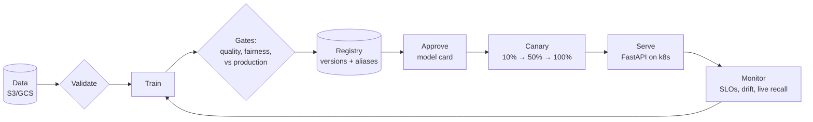

# churn-mlops: production ML deployment, end to end

A complete, production-grade reference for deploying an ML model: a
telecom **customer-churn** classifier taken from raw data to a secured,
monitored, canary-released service on **Kubernetes (AWS EKS or GCP GKE)**,
with Terraform, CI/CD, model governance and on-call runbooks.

The ML is deliberately simple (gradient boosting on tabular data) so all the
attention goes to *everything around the model*: the 90% that makes it
production.



## What's inside

| Area | What you get | Where |
|---|---|---|
| **ML code** | Data contract, validation, sklearn Pipeline, cost-based threshold, calibration, fairness audit, champion/challenger, model card | `src/churn/` |
| **Registry** | Immutable versions, `staging`/`production` aliases, audit history, checksum + library-version checks; local, S3, GCS or MinIO | `src/churn/registry.py` |
| **Serving** | FastAPI with API keys, strict schema, `/v1` versioning, probes, JSON logs, Prometheus metrics, OpenTelemetry, pseudonymised prediction/feedback events | `src/churn/api.py` |
| **Batch** | Nightly scoring job using the same predictor | `src/churn/predict.py`, CronJob |
| **Containers** | Multi-target Dockerfile (serve/train), hashed lockfile, non-root; docker-compose stack with MinIO, Prometheus, Grafana | `Dockerfile`, `docker-compose.yml` |
| **Kubernetes** | Kustomize base + canary/prod components + 5 overlays (local kind, AWS/GCP × staging/prod); Gateway API, HPA, PDB, NetworkPolicy, External Secrets, CronJobs | `k8s/` |
| **Infrastructure** | Terraform for AWS (VPC, EKS, ECR, S3, KMS, Pod Identity, GitHub OIDC) and GCP (VPC, GKE Autopilot, Artifact Registry, GCS, KMS, Workload Identity) | `infra/` |
| **CI/CD** | CI (lint, security, tests, IaC scans, image scan, e2e + load test); free CD rehearsal on kind (deploy, release, rollback); release (build once, sign, staging, approval, automated canary); model release; infra plan/apply; pre-commit, PR template, CODEOWNERS | `.github/` (hidden folder), `.pre-commit-config.yaml` |
| **Observability** | SLO burn-rate alerts, model-quality alerts, Grafana dashboard, drift (PSI) and live-accuracy scripts | `monitoring/`, `scripts/` |
| **Docs** | Architecture (15 diagrams), concepts, deploy guide, operations runbook, security, session plan | `docs/` |
| **Tests** | 76 tests: data, model behaviour, API contract, registry (incl. S3), release tooling, **policy tests on rendered k8s manifests** | `tests/` |

## Quick start

```bash
python -m venv .venv && source .venv/bin/activate
make install
make data train promote     # data -> gated model -> production alias
make test
make serve                  # http://localhost:8000/docs   (X-API-Key: dev-key)
make smoke                  # second terminal
```
Then: `make up` (full local stack) → `make kind-up` (local Kubernetes) → cloud
(see [docs/DEPLOY.md](docs/DEPLOY.md)). `make help` lists every target.

## Documentation

| Doc | Read it to… |
|---|---|
| [docs/ARCHITECTURE.md](docs/ARCHITECTURE.md) | See how everything fits: 15 architecture, sequence and flow diagrams |
| [docs/CONCEPTS.md](docs/CONCEPTS.md) | Understand *why* each piece exists (what / why / where) |
| [docs/DEPLOY.md](docs/DEPLOY.md) | Run it: laptop → docker compose → kind → AWS or GCP |
| [docs/OPERATIONS.md](docs/OPERATIONS.md) | Operate it: SLOs, alert runbooks, rollback, key rotation, capacity, incidents |
| [docs/SECURITY.md](docs/SECURITY.md) | Threat model, identity map, supply chain, scanner exceptions |
| [docs/SESSION_1_RUNBOOK.md](docs/SESSION_1_RUNBOOK.md) | Mentoring plan: 90-min walkthrough + 8 labs |
| [docs/TEACHING_GUIDE.md](docs/TEACHING_GUIDE.md) | Full mentoring course: 11 modules (deep CI/CD), labs, checkpoints, rubric |

## Repository map

```
src/churn/            config (data contract) · data · features · train · model_card
                      registry · promote · predict · schemas · observability · api
scripts/              generate_data · bootstrap_storage · release · deploy.sh · smoke_test.sh
                      canary_analysis · check_slo · drift_report · live_eval · sync_alerts
tests/                test_data · test_model · test_registry · test_api · test_release · test_k8s
k8s/base/             app manifests (cloud-agnostic)
k8s/components/       canary · prod
k8s/overlays/         local · aws-staging · aws-prod · gcp-staging · gcp-prod  (+ release/ state)
k8s/platform/         gateway + TLS + secret store per cloud (once per cluster)
infra/aws|gcp/        Terraform stacks (+ envs/*.tfvars)
infra/bootstrap/      cluster add-ons (Helm) + values
monitoring/           alerts.yml (single source) · prometheus.yml · Grafana dashboard
.github/workflows/    ci · cd-kind · release · model-release · infra
.github/actions/      cloud-auth · push-images · k8s-tools · canary-gate · commit-release
Dockerfile · docker-compose.yml · Makefile · pyproject.toml · requirements.lock · locustfile.py
```

## API

| Method | Path | Auth | Purpose |
|---|---|---|---|
| POST | `/v1/predict` | key | Score one customer |
| POST | `/v1/predict/batch` | key | Score ≤ 1,000 customers |
| POST | `/v1/feedback` | key | Ground truth (did they churn?) for live evaluation |
| GET | `/v1/model-info` | key | Version, metrics, threshold, data fingerprint |
| GET | `/v1/admin/registry` | admin key | Versions, aliases, promotion history |
| GET | `/health`, `/ready` | none, in-cluster | Liveness / readiness |
| GET | `/metrics` | none, in-cluster | Prometheus |

```bash
curl -X POST localhost:8000/v1/predict -H 'X-API-Key: dev-key' -H 'Content-Type: application/json' -d '{
  "customer_id": "C1", "tenure_months": 3, "monthly_charges": 89.5, "total_charges": 268.5,
  "num_support_tickets": 4, "contract_type": "month-to-month",
  "payment_method": "electronic_check", "internet_service": "fiber", "senior_citizen": 0}'
# {"customer_id":"C1","churn_probability":0.93,"will_churn":true,"risk_band":"high","model_version":"v2026..."}
```

## Placeholders to replace before a real cloud deploy
`acme` (bucket prefix / org), `acme/churn-mlops` (GitHub repo), account
`123456789012`, projects `acme-churn-*`, `example.com`, regions
(`ap-south-1` / `asia-south1`). See [docs/DEPLOY.md](docs/DEPLOY.md).
