# Architecture

This document explains **what runs where, and how data, models and code move
through the system**. Every diagram is Mermaid, so it renders on GitHub/GitLab
and in most Markdown viewers.

Contents
1. [System context](#1-system-context)
2. [Cloud deployment (AWS and GCP)](#2-cloud-deployment-aws-and-gcp)
3. [Inside the Kubernetes namespace](#3-inside-the-kubernetes-namespace)
4. [Code structure](#4-code-structure)
5. [Request flow: one prediction](#5-request-flow-one-prediction)
6. [Training and retraining flow](#6-training-and-retraining-flow)
7. [Model registry data model](#7-model-registry-data-model)
8. [CI: what runs on every pull request](#8-ci-what-runs-on-every-pull-request)
9. [Code release: build once, promote everywhere](#9-code-release-build-once-promote-everywhere)
10. [Model release: new model, same code](#10-model-release-new-model-same-code)
11. [Canary state machine](#11-canary-state-machine)
12. [Observability: logs, metrics, traces, alerts](#12-observability-logs-metrics-traces-alerts)
13. [Security layers](#13-security-layers)
14. [Feedback loop: monitoring to retraining](#14-feedback-loop-monitoring-to-retraining)
15. [Key design decisions](#15-key-design-decisions)

---

## 1. System context

Who talks to the system, and what it depends on.

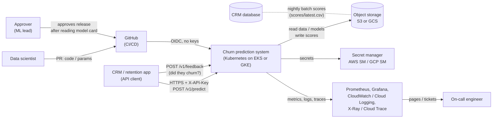

## 2. Cloud deployment (AWS and GCP)

The **app layer is identical on both clouds**. Only the infrastructure layer
(Terraform) and a tiny platform layer differ.

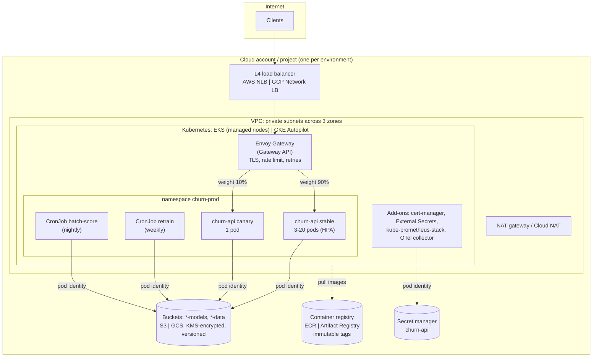

| Concern | AWS | GCP | Cloud-agnostic piece |
|---|---|---|---|
| Kubernetes | EKS + managed node group | GKE Autopilot | Kubernetes manifests (`k8s/`) |
| Pod → cloud identity | EKS Pod Identity | Workload Identity Federation | ServiceAccounts (no annotations needed) |
| Object storage | S3 (+ VPC endpoint) | GCS (+ Private Google Access) | `fsspec` URIs `s3://` / `gs://` |
| Images | ECR (immutable, scan on push) | Artifact Registry (immutable) | OCI images, cosign signatures |
| Secrets | Secrets Manager | Secret Manager | External Secrets Operator |
| Load balancer | NLB via AWS LB Controller | Network LB | Gateway API + Envoy Gateway |
| Traces | X-Ray | Cloud Trace | OpenTelemetry |
| Metrics | (Amazon Managed Prometheus) | (Google Managed Prometheus) | Prometheus + PodMonitor |
| CI → cloud auth | GitHub OIDC → IAM role | GitHub OIDC → WIF → SA | GitHub environments |
| IaC | `infra/aws` | `infra/gcp` | Terraform |

## 3. Inside the Kubernetes namespace

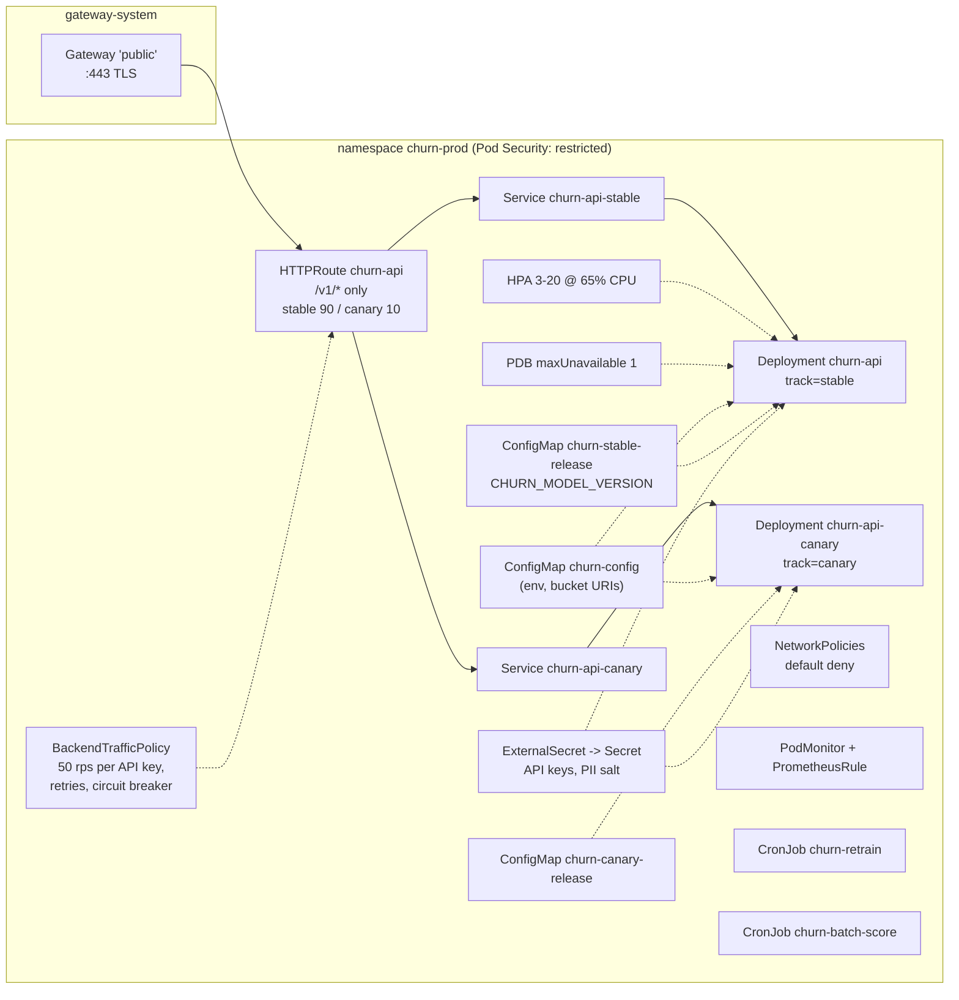

**Kustomize layering:** `base/` (everything) + `components/canary` +
`components/prod` + `overlays/<cloud>-<env>/` (bucket URIs, hostname) +
`overlays/<cloud>-<env>/release/` (machine-managed: image tags, model versions,
traffic weights).

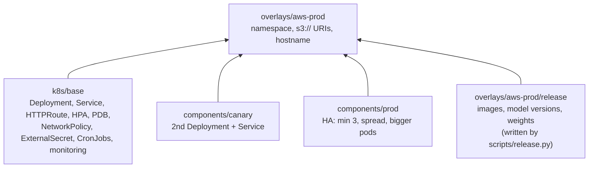

## 4. Code structure

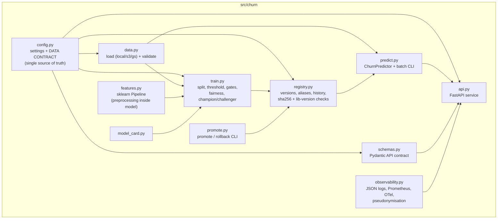

Scripts (`scripts/`) are the operational tools: `generate_data`,
`bootstrap_storage` (local only), `release` (canary state), `deploy.sh`,
`smoke_test.sh`, `canary_analysis`, `check_slo`, `drift_report`,
`live_eval`, `sync_alerts`.

## 5. Request flow: one prediction

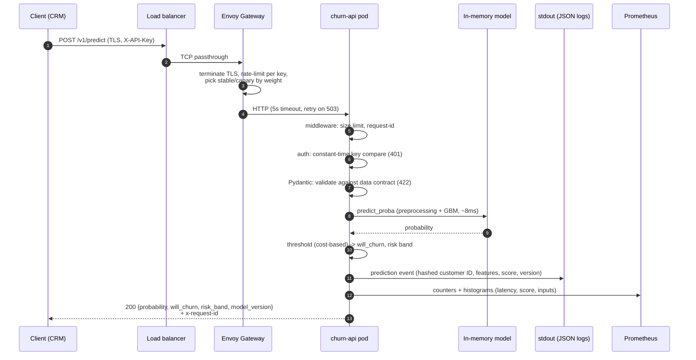

Startup is different: the pod downloads a **pinned** model version from
object storage, verifies its SHA-256 and scikit-learn version, and only then
reports `/ready`. Kubernetes sends no traffic until then.

## 6. Training and retraining flow

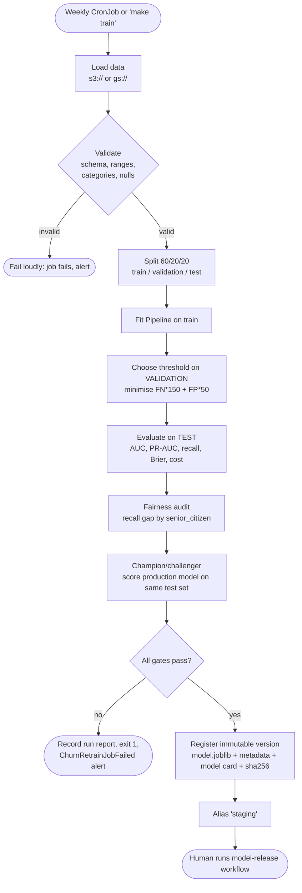

Gates (all configurable via env vars): ROC-AUC ≥ 0.75, recall ≥ 0.60,
Brier ≤ 0.20, fairness recall gap ≤ 0.15, not worse than production by
more than 0.01 AUC.

## 7. Model registry data model

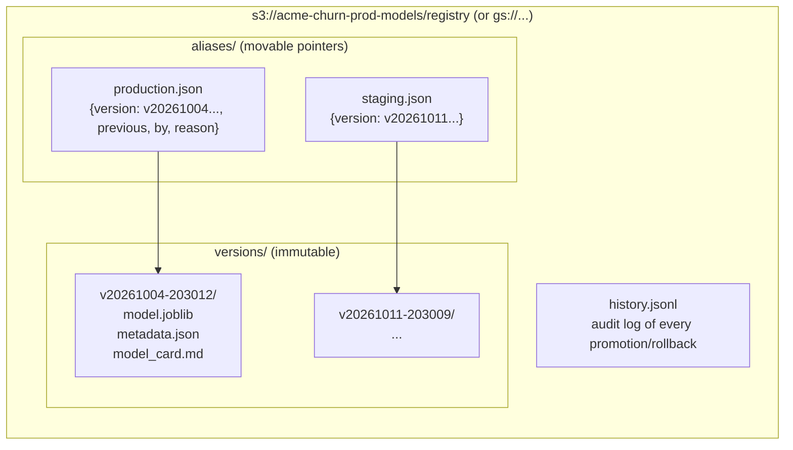

`metadata.json` holds: metrics, gates, threshold and costs, fairness,
calibration, feature importance, data URI + fingerprint + row counts,
training reference distributions (for drift), library versions, artifact
SHA-256. **Who can write what** is enforced by IAM (infra/*/iam.tf): the
trainer can add versions and move `staging` only; only the CI deployer,
after approval, can move `production`.

## 8. CI: what runs on every pull request

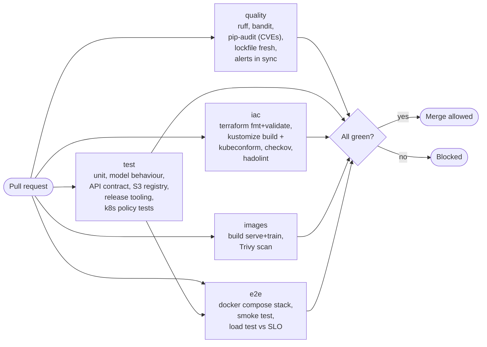

## 9. Code release: build once, promote everywhere

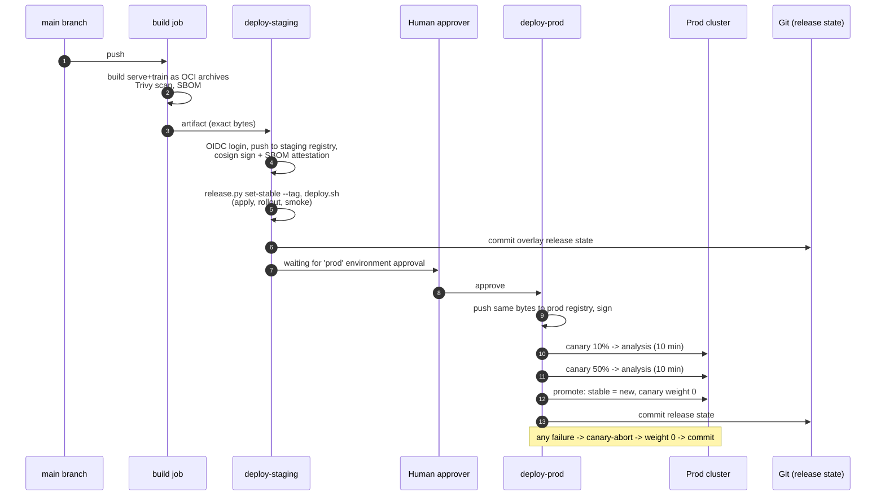

## 10. Model release: new model, same code

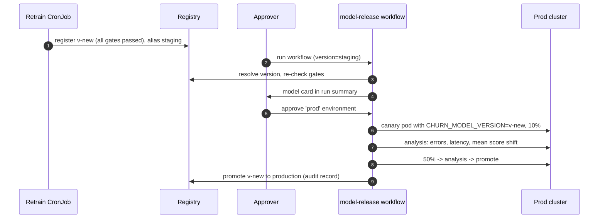

Code and model have **independent release trains**: a model change never
needs a new image, and a code change keeps the current model.

## 11. Canary state machine

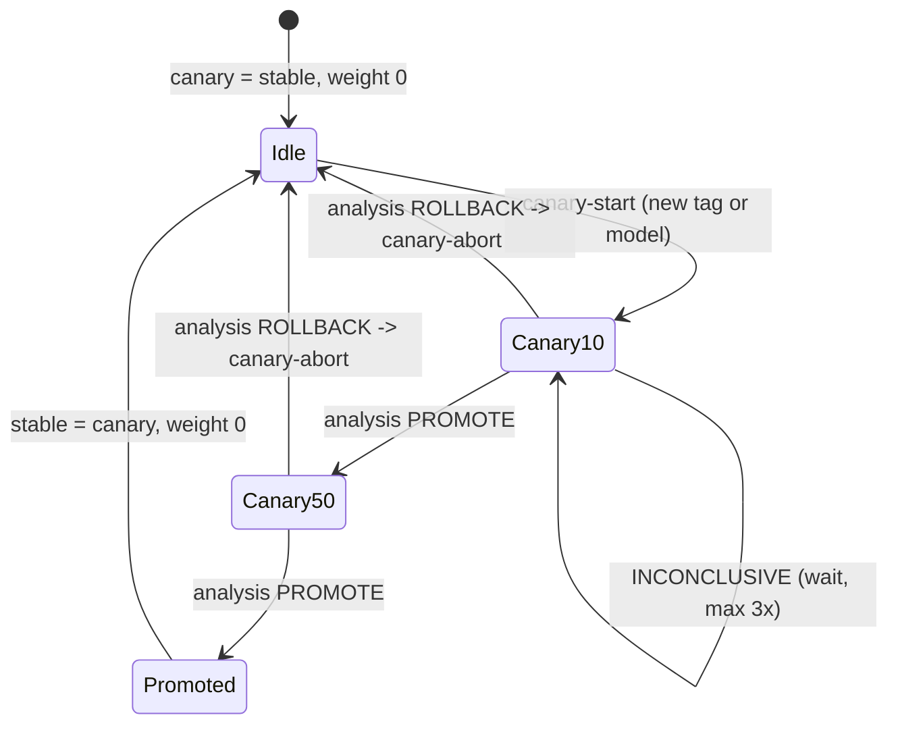

Analysis (`scripts/canary_analysis.py`) compares canary vs stable over the
window: error ratio (+0.5 pp max), p95 latency (×1.2 + 20 ms max), mean
predicted score (±0.15 max) and requires ≥ 200 requests.

## 12. Observability: logs, metrics, traces, alerts

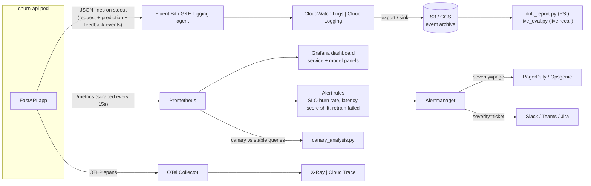

Three kinds of signal, because a service can be **up but wrong**:

| Signal | Question it answers | Where |
|---|---|---|
| Service health | Is it up, fast, error-free? | `/metrics` → SLO burn-rate alerts |
| Model behaviour | Are inputs or scores shifting? | score/input histograms, PSI report |
| Model quality | Is it still *right*? | feedback join → live recall |

## 13. Security layers

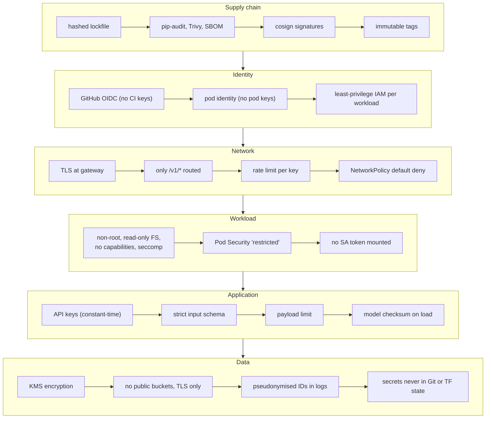

## 14. Feedback loop: monitoring to retraining

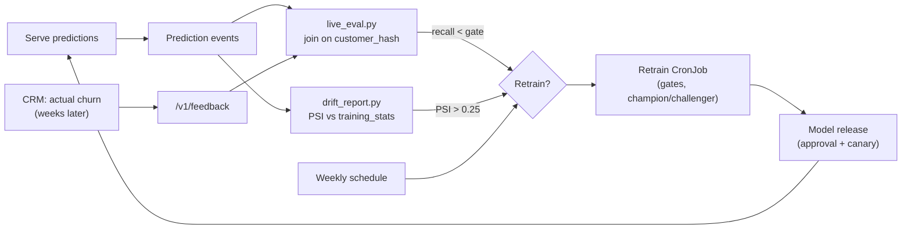

## 15. Key design decisions

| Decision | Why | Alternative (when to choose it) |
|---|---|---|
| Preprocessing inside the saved Pipeline | Removes training/serving skew | Feature store (many models sharing features) |
| Registry on object storage | Zero extra infrastructure; same on AWS/GCP/local | MLflow / SageMaker / Vertex AI registry (many teams, UI, lineage) |
| Model pulled at startup, pinned version | Model and code release independently | Bake model into image (tiny model, strict immutability) |
| One Uvicorn worker per pod, `OMP_NUM_THREADS=1` | Predictable memory, correct metrics, no thread fights; scale with pods | Gunicorn multi-worker on VMs |
| Kustomize over Helm | Plain YAML, easy to read and diff | Helm (distributing to many external users) |
| Gateway API + Envoy Gateway | ingress-nginx retired (Mar 2026); weighted canary built into the standard | Istio / Argo Rollouts (bigger platform needs) |
| Push-based deploy from CI, state committed to Git | Easy to follow end to end | Argo CD / Flux GitOps (pull-based, drift correction) |
| API keys | Simple for server-to-server | OAuth2 client credentials / mTLS (many clients, fine-grained scopes) |
| Human approval for prod | Model decisions affect customers | Fully automatic once trust is earned (strong canary + monitoring) |
